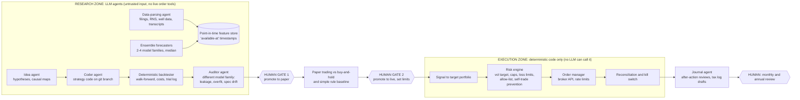

# Hire AI Agents as Staff, Not Traders

*Not financial, legal or tax advice. This report summarises published research, podcast show notes, a third-party transcript and a static reading of open-source code, for educational purposes only. It recommends no product, broker, strategy or legal structure. UK regulatory and tax points are general information, and several are marked **[UNVERIFIED]** because they were not checked against a primary source. Take regulated legal, tax and financial advice before you trade, form a company or accept anyone else's money.*

An AI-agent-run trading firm is buildable for a UK retail trader, but only if the agents do the work of a research staff and never the job of the trader or the risk manager. The evidence has hardened since the earlier report. No live or post-training-cutoff test shows LLM agents, alone or in "swarms", reliably beating buy-and-hold after costs. In real-money contests **4 of 6 models lost 42–59%** in one season and **only 6 of 32 runs were profitable** in the next. A May 2026 survey found that of 92 agentic-trading studies, only 19 had closed-loop evaluation, and **just one modelled transaction costs**. The institutions that do make agents pay use them the same way: Man Group's AlphaGPT drafts signals, writes code and backtests it, then passes it through the same investment committee as human ideas. Humans keep risk and execution even inside Bridgewater's ML-run fund, which returned **+11% in 2025 against +34% for its human-led flagship**. Swarms help only in the narrow sense that averaging *diverse* models reduces error. Debate between agents adds little beyond a majority vote, and many personas running on one model give you correlated mistakes, not a crowd. MiroFish, the viral "swarm intelligence engine", simulates social-media chatter and writes a narrative report. It produces no prices or probabilities and has published no accuracy evidence, so it is not a trading tool. At most it can red-team a thesis. The three new podcasts, all from the same show that supplied the earlier McKeown and Pasquet episodes, add useful process ideas: Smolinski's numeric trade log and synthetic stress tests, and Josh Young's point that the edge sits in filings nobody reads. Their headline returns, however, are unaudited and shrink on inspection. The workable firm has three layers: agents propose, deterministic code disposes, and a human promotes. It grows legally one step at a time: your own money first, then a single-owner company, and outside money only through an authorised host once you have an independently verifiable track record.

**Where the podcast content came from.** None of the three episodes' audio could be accessed directly, because YouTube rate-limited every request. Content labelled **[show notes]** comes from the official episode descriptions on Substack, Spotify and Apple and is topic-level only, with no verbatim quotes. Content labelled **[transcript]** comes from a third-party transcript page (youtubetotranscript.com) read through a summarising fetch tool, so the wording may be slightly off. Content labelled **[other]** comes from the guests' other interviews and press coverage. Only the Smolinski episode had a transcript.

## Five episodes, one show: read the titles as marketing

All three new episodes are from **Odds on Open**, hosted by Ethan Kho and produced by Patrick Kho, a weekly show of about 74 episodes ([Apple Podcasts](https://podcasts.apple.com/ph/podcast/odds-on-open/id1802640849)). The earlier report's McKeown and Pasquet episodes came from the same show. So every podcast source across both reports was chosen by one editorial team, and that matters. The guests are selected for strong stories, and the YouTube titles are written to be clicked, not to be accurate. Each of the three new titles overstates what sits behind it. "Billionaire Hedge Fund Managers" names no billionaires or funds in its show notes. The guest is a data-science consultant ([Substack](https://ethankho.substack.com/p/how-billionaire-hedge-fund-managers-5b8)). "~100% Returns" is higher than the 79% figure a journalist checked a few days before year-end. "World's #1 Oil Hedge Fund Manager" has no ranking behind it that I could find, and the fund is not an oil trading fund at all.

| Episode (title claim) | What the evidence actually shows | Verification status |
|---|---|---|
| Zatreanu, "Billionaire Hedge Fund Managers…" (27 Mar 2026) | Guest is Matei Zatreanu, founder of the data consultancy System2 and formerly at King Street; no named funds in the show notes | Metadata confirmed; content is show notes only |
| Smolinski, "~100% in 2025, no losing year since 2008" | Business Insider saw **screenshots of summary statements** showing **79% for 2025 as of 21 Dec 2025**; no account size; his first two years were negative | Self-reported; not audited to GIPS or by a broker |
| Young, "World's #1 Oil Hedge Fund Manager… 200% while everyone lost 60%" | Long-only, concentrated **small-cap oil and gas equities** fund; "200%" is **since 2015 inception**, about **10–11% a year** compounded | Self-reported; figures conflict across sources |

### Zatreanu: institutions point agents at research, not at the order button

**[show notes]** The episode is about "the technical architecture of the data science layer within fundamental hedge funds". It covers three uses of generative AI: **AI interview agents** that automate expert-network calls and analyse what comes back; **LLM-built causal graphs** that map "second-order macro effects"; and outlier detection. The central warning is "differentiated alpha vs. the consensus echo chamber": off-the-shelf models push toward what everyone already believes. The show notes also say the best PMs treat investing "as a craft rather than a business operation" ([Substack](https://ethankho.substack.com/p/how-billionaire-hedge-fund-managers-5b8)). The show notes do not mention autonomous trading. This is Pasquet's "speed-to-consensus" point from the earlier report, made by someone who builds data teams for large funds. The public record fills in what the episode leaves out. Man Group's AlphaGPT is a three-stage pipeline: an idea generator, an implementer that writes Python, and an evaluator. Its authors call it "a digital three-person research team that never sleeps". They also say off-the-shelf LLMs do "intern-level work", that the firm "can't leave it unsupervised just yet", and that its main risks are p-hacking and drift between the stated idea and the code that implements it ([Man Group](https://www.man.com/insights/what-ai-can-do-for-alpha)). It produced "several dozen" signals, of which only an undisclosed handful went live ([Hedgeweek](https://www.hedgeweek.com/man-group-deploys-agentic-ai-for-quant-signal-discovery/)). At Balyasny, **95% of investment teams** use its research engine. One agent cut central-bank speech analysis from two days to about 30 minutes, and models are picked task by task after scoring on 12+ evaluation dimensions ([OpenAI case study](https://openai.com/index/balyasny-asset-management/)). Across the industry, **95% of managers** now use GenAI ([AIMA](https://www.aima.org/article/press-release-front-office-gen-ai-adoption-shifts-from-if-to-when-for-leading-fund-managers-aima-research-finds.html)). So the tools are everywhere. What separates the firms that benefit is **what the agents are fed and what gate they must pass**, not whether they use agents at all.

For a UK individual, Zatreanu's two concrete ideas translate well. First, an "interview agent" becomes an agent that structures what you learn from company AGMs, trade-press interviews, earnings-call Q&A, or customers in your own industry. Second, a "causal graph" becomes an explicit, versioned map of second-order effects, for example Hormuz closure → tanker rates → refinery margins → UK-listed shippers. You own the map and the agent maintains it. Both produce differentiated inputs, which is the only kind of edge McKeown's "data is being decimalised" thesis leaves open.

### Smolinski: the process transfers, the returns do not

**[transcript]** Smolinski's most useful line is that edge "is not" hard to find: "The real thing that's hard is accepting it won't look flashy." His edges are harvesting risk premia, riding momentum and sector rotation, exploiting institutional flows such as month-end window dressing, and switching between "profit mechanisms" as regimes change. He lists retail's structural advantages as agility, "the ability to not trade", and small, illiquid "back alley" niches where "there's less competition". His signature structure is a **ratio call diagonal**: long calls 90+ days out, part-funded by selling 2–4-week calls at a ratio. That keeps the upside uncapped, which a normal diagonal does not, because with a normal diagonal you "can be too right" ([transcript](https://youtubetotranscript.com/transcript?v=fVTepbK7fK8)). This is long convexity with a long horizon, the opposite of the 0DTE lottery tickets the earlier report flagged as a retail loser. So "options" is not one category. His process is the most transferable part. He writes his own trading plan, "Not one that Claude made for you, not one that ChatGPT made for you". He keeps a **trade log with numeric columns** built for later analysis, uses a paper pre-trade checklist, and runs post-mortems that "nerf the wins first". He walk-forward tests across 2007 and 2020, and builds **synthetic stress tests** such as a COVID crash stretched over a normal 298-day bear market. He also ran paper trackers at his real account size and at 10x to get used to seeing larger numbers (same source). Business Insider adds monthly after-action reviews, annual reviews lasting up to two weeks, and a benchmark set of SPY, QQQ, IWM, TLT and GLD ([Business Insider via AOL](https://www.aol.com/news/stock-trader-consistently-beats-p-103001203.html)).

The performance claims deserve scepticism. The only third-party check is Business Insider "looking at screenshots of his summary statements", which reported **79% for 2025**, an average of **24.6% a year over 2018–22**, and his first two years negative. Account size is never disclosed (same source). An earlier profile quoted a **22.8% CAGR over 14 years** ([Stocks for Beginners](https://www.stocksforbeginners.net/blog/esinvests)). He sells trading education, so he has a commercial reason to present results well ([Barchart press release](https://www.barchart.com/story/news/21549091/from-financial-struggles-to-financial-freedom-erik-smolinski-unveils-esinvests-and-the-outlier-community-for-aspiring-investors)). He admits to a "largest percent draw down" caused by overconfidence but gave no figure, and I found no 2022 return, which is the year that would test "no losing year". He names the variance risk premium as a core edge. Yet Chicago Fed research finds S&P 500 option alphas "have become indistinguishable from zero" over roughly the past 15 years, with a structural break around 2012 ([Chicago Fed WP 2025-17](https://www.chicagofed.org/-/media/publications/working-papers/2025/wp2025-17.pdf?sc_lang=en)). OptionSellers.com shows how selling premium without limits ends: about $150m across 290 accounts was wiped out by one natural-gas spike ([Early Retirement Now](https://earlyretirementnow.com/2018/12/18/the-optionsellers-debacle/)). For an agent-run firm, the lesson is to automate his *process* (screens, logs, checklists as hard gates, stress tests, regime flags) and to accept that his *judgement* (theme recognition, reading flows around VWAP, fills in illiquid chains) does not automate. His "back alley" edge actively works against automation, because agents trading illiquid option chains face exactly the fills and adverse selection that backtests cannot model.

### Young: the edge is in filings nobody reads, and it is slow

**[show notes]** Josh Young of Bison Interests runs a "concentrated, long-only public equities energy fund". The episode covers discounts to liquidation value and reserve appraisals, position sizing across conviction buckets, **deleveraging setups** as a large source of alpha, activist campaigns and proxy fights in small-cap E&Ps, the illiquidity premium, "fundamental research advantages from state filings", and "AI applications in energy analysis" ([Spotify](https://open.spotify.com/episode/764MMdQfc1bKUISgaVq2iG)). **[other]** Elsewhere he says "people will do anything to avoid reading a 10-K" and that he checks theses against state data, well data libraries and midstream presentations ([Idea Brunch](https://www.readideabrunch.com/p/idea-brunch-with-josh-young-of-bison)). As chairman of RMP Energy he replaced the board and sold the company at a premium of about 78% ([Yahoo/Hart Energy](https://finance.yahoo.com/news/forty-under-40-josh-young-050000296.html)). This supports the earlier report's commodities conclusion from a different direction. The best-known "oil" manager on the show makes his money from slow, research-heavy, illiquid equity stock-picking and activism, not from trading crude futures.

The numbers do not support "World's #1". Reported figures are **+349% net in 2021** ([Idea Brunch #2](https://www.readideabrunch.com/p/idea-brunch-2-with-josh-young-of)), which a promotional newsletter gave as 390% ([Banyan Hill](https://banyanhill.com/how-bison-interests-founder-josh-young-made-390-profits/)); **about 130% since inception** by February 2023 ([Trose pod](https://trosepod.com/blogs/podcast/josh-young)); and **200%** by August 2026. If one year multiplied capital about 4.5x and the cumulative gain by 2023 was only about 130%, the years before 2021 were probably deeply negative in total. That is my inference and is **unverified**, but the pattern points to one exceptional year inside a volatile record, not steady skill. He also sells stock picks through a paid Substack for up to $5,000 a year and discloses that he owns the names he writes about ([Bison Insights](https://www.bisoninsights.info/about)). His 2026 view that oil could reach **$200–250 if Hormuz stays closed** is conditional advocacy from a consistent public bull ([Competent Man pod](https://competentmanpod.substack.com/p/josh-young-200-oil-latest-iran-peace)). For an agent firm, the useful takeaway is the job he describes: extracting well-level production data and reserve reports and screening for enterprise value below reserve value or fast deleveraging. That is document-parsing grunt work, and LLMs do it well. The judgement, board access and patience that turned the research into returns cannot be automated.

## Agent swarms add labour and variance reduction, not foresight

"Do swarms work?" has two answers, depending on what the swarm is asked to do. As a **forecaster that aggregates independent views**, a diverse ensemble does work. A 12-LLM ensemble matched a 925-person human crowd on Metaculus questions (Brier score **0.20 vs 0.19**), but the models leaned toward "yes" (mean forecast 57% against a 45% base rate), and a simple average of human and machine forecasts beat the models' own updated forecasts ([Schoenegger et al., Science Advances](https://www.science.org/doi/10.1126/sciadv.adp1528); [arXiv](https://arxiv.org/html/2402.19379v6)). As a **debating committee**, the evidence is weak. "Majority Voting alone accounts for most of the performance gains" attributed to multi-agent debate, and debate by itself "does not improve expected correctness" ([arXiv 2508.17536](https://arxiv.org/abs/2508.17536)). The gains come from member strength and **team diversity**, while structural tweaks "offer limited gains" and majority pressure "suppresses independent correction" ([arXiv 2511.07784](https://arxiv.org/abs/2511.07784)). As a **trader**, the swarm has no positive evidence. TradingAgents' reported Sharpe ratios of **5.6–8.2** come from one three-month window in early 2024, five mega-caps, a single run and no costs, and each decision needed **11 LLM calls plus 20+ tool calls** ([arXiv 2412.20138](https://arxiv.org/html/2412.20138)). One unreviewed reproduction with anonymised tickers after the models' training cutoff returned **−0.9% against +15.7%** for buy-and-hold ([trading-agents-lab, unverified](https://github.com/Kantamaniprakash/trading-agents-lab)). FINSABER re-tested LLM strategies over two decades and 100+ symbols and found the reported advantages "deteriorate significantly". It also found the agents were too cautious in bull markets and too aggressive in bear markets ([arXiv 2505.07078](https://arxiv.org/abs/2505.07078)). One survey reports FinMem's **23% return reversing to −22%** under controlled conditions and finds that no system it reviewed meets more than 2 of 5 basic evaluation standards ([arXiv 2603.27539](https://arxiv.org/html/2603.27539v1)).

The live record points the same way. In Alpha Arena Season 1, six frontier models traded $10,000 each in crypto perpetuals, and **four lost 42–59%** ([ForkLog](https://forklog.com/en/four-out-of-six-ai-models-suffer-losses-in-trading-tournament/)). In Season 1.5 on US equities, models collectively lost about a third of roughly $320k, and one model made **1,418 trades** where the winner made 158 ([Business Standard](https://www.business-standard.com/markets/news/ai-bots-auditioning-for-wall-street-trading-are-mostly-losing-money-126050701793_1.html)). That is the retail overtrading pattern from the earlier report, automated. LiveTradeBench found that neither general benchmark rank nor extended reasoning predicted trading results ([arXiv 2511.03628](https://arxiv.org/html/2511.03628v1)). The organiser of Nof1, which ran Alpha Arena, sums it up: "LLMs can't really make money by themselves… you need basically a very sophisticated harness and scaffolding" (Business Standard, above). Every live test so far pits single models against each other, so "multi-agent beats single-agent in live trading" is **untested rather than disproven**. A useful cost test from the survey literature is the "coordination breakeven spread": coordination adds value only if the signal improvement exceeds the instrument's bid-ask spread ([arXiv 2603.27539](https://arxiv.org/html/2603.27539v1)). At UK retail spreads, most swarm refinements will fail it.

The one agentic result that holds up is **agents as a research lab**. Microsoft's R&D-Agent-Quant has agents propose factors and models, write the code, and have Qlib evaluate it with transaction costs. On CSI 300 over 2017–2020 it reported **14.21% annualised with an information ratio of 1.74**, against 5.70% for a 158-factor baseline, at a cost of **under $10 per run** ([arXiv 2505.15155](https://arxiv.org/pdf/2505.15155v2)). The test period falls before the models' training cutoffs. But a deterministic backtester judges coded factors, so the leakage path is narrower than when an agent chooses trades directly. **Verdict:** use a swarm as a *division of labour* (researcher, coder, auditor from a different model family) and as a *numeric ensemble* across different model families, combined by median. Never use it as a bull/bear debate that outputs orders. Averaging reduces variance. It cannot create an edge that no member has.

## MiroFish simulates chatter, not markets

MiroFish (about **72k GitHub stars** by September 2026) is a Flask and Vue app under the AGPL-3.0 licence. It turns an uploaded document into a Zep Cloud knowledge graph and generates agent personas from the graph's entities. It then runs them on CAMEL-AI's OASIS simulated Twitter and Reddit, and finally has a "ReportAgent" write a "future prediction report" ([README](https://github.com/666ghj/MiroFish/blob/main/README.md)). A static reading of the code at HEAD 39d8491 (nothing was executed) shows several things. The ontology prompt is explicitly designed "for social-media opinion simulation". Each run produces one stochastic trajectory with no seed or ensemble loop. The output is a 2–5 section narrative with **no probability, confidence or numeric forecast field**. The report prompt tells the model that the agents' behaviour "ARE the prediction of future human behaviour", which assumes by construction that the simulation predicts the world. My inference, **not confirmed by the maintainers**, is that the "God's-eye" variable injection the README advertises, and config fields such as `echo_chamber_strength` and `scheduled_events`, are generated but never read by the simulation loop. Only the initial posts reach OASIS. Finance examples are still "coming soon". In the one GitHub discussion on market prediction, the only substantive reply (from a bot) says there is no market-data or trading integration and calls it "a decision-support tool, not a production predictor" ([Discussion #280](https://github.com/666ghj/MiroFish/discussions/280)). Press coverage agrees that no benchmarks against real outcomes exist ([PANews](https://panews.io/articles/019cf53a-ca7c-7159-9fbc-40859cdfa108); [YourStory](https://yourstory.com/ai-story/mirofish-ai-explained-hype-vs-reality)). Viral claims of "700,000 agents" and "probability distributions" have no source and are contradicted by the code ([abhs.in](https://www.abhs.in/blog/mirofish-swarm-ai-700000-agents-predict-markets-public-opinion-2026)). Claims that it helps Polymarket bettors are unverified anecdotes. The project's story (a 20-year-old student, built in 10 days, a reported ¥30m pledge from Shanda's founder) explains the attention better than any validation does. Commits since July 2026 look like maintenance mode.

The research behind it points away from market use. OASIS agents are "more susceptible to the herd effect compared to humans" ([arXiv 2411.11581](https://arxiv.org/abs/2411.11581)). LLM traders in experimental markets price close to fundamentals and show "less trading strategy variance" than humans ([arXiv 2502.15800](https://arxiv.org/abs/2502.15800)). Shared prompts produce correlated behaviour ([arXiv 2504.10789](https://arxiv.org/abs/2504.10789)). Backtesting on historical events is compromised because LLMs have memorised pre-cutoff financial data ([arXiv 2504.14765](https://arxiv.org/abs/2504.14765)). A MiroFish "crowd" is one model speaking through many personas, the same error the swarm section warns about. The positive evidence for LLM forecasting comes from *direct* probability forecasts that are aggregated and scored: several AI systems are now statistically indistinguishable from superforecasters on ForecastBench ([FRI](https://forecastingresearch.substack.com/p/ai-models-have-likely-reached-parity)). MiroFish does none of that. My rough cost estimate (**unverified**) is 1,500–7,000 agent calls per default 72-round run: a few dollars on a cheap model, tens of dollars on frontier models, taking minutes to hours. That rules out intraday use.

**Verdict:** MiroFish is **not useful for generating trading signals**. It is marginally useful for red-teaming a thesis. You can seed it with your thesis document, an earnings release or a policy draft and interview simulated bears, regulators or retail crowds to find objections and narratives you missed. Treat the output as brainstorming, never as evidence. If you do experiment with it, run many seeds across several model families, extract structured sentiment features, and score them only against events that happen after the run, compared with a cheap baseline of direct LLM probability forecasts. Two practical cautions apply. The default setup sends your document to Zep Cloud and Alibaba's DashScope API, which is a confidentiality problem for a proprietary thesis. The AGPL licence imposes obligations if you expose a modified version as a network service.

## Reference architecture: agents propose, code disposes, humans promote

The architecture follows directly from the evidence above and from security practice. Meta's "Agents Rule of Two" says an agent should combine at most two of three things: processing untrusted input, accessing sensitive systems, and changing state externally ([Simon Willison](https://simonwillison.net/2025/Nov/2/new-prompt-injection-papers/)). An agent that reads the news, sees your account *and* places orders breaks that rule by design, and prompt injection through web content has been observed in the wild ([Unit 42](https://unit42.paloaltonetworks.com/ai-agent-prompt-injection/)). So the LLMs live in a research zone that has read-only data and, at most, a paper-trading tool. Money moves only through deterministic code, which a human has approved.

The "firm" becomes a set of roles, and each role has a clear owner type.

| Firm role | Owner | What it does | Why this owner |
|---|---|---|---|
| CIO / arena selection | **Human** | Chooses the market, holding period and edge thesis; signs off every new strategy | Pasquet's game selection and Zatreanu's "craft" point: the variant view is the edge |
| Research analysts | **Agents** | Parse filings, RNS announcements, state well data and call transcripts into typed, schema-validated fields; maintain causal maps | Balyasny-style speed-ups; Young's "filings nobody reads" edge |
| Quant developer | **Agent** (coding) | Writes strategy code on a branch with tests; cannot deploy | Man AlphaGPT and R&D-Agent-Quant pattern |
| Backtest engine | **Deterministic code** | Walk-forward tests, costs and slippage, survivorship-free data, every trial logged, deflated Sharpe | Overfitting defences from the earlier report |
| Model auditor | **Agent** from a different model family, **plus code checks** | Looks for leakage and drift between spec and code; compares against a pre-registered spec | Man's "idea-to-code drift" risk; different family to avoid correlated errors |
| Forecast panel ("swarm") | **Agents**, 2–4 model families | Numeric probability or score, combined by median; one input among several | Diversity helps, debate does not |
| Portfolio construction | **Deterministic code** | Signals to target weights | Reproducible, testable |
| Risk manager | **Deterministic code**, limits set by a **human** | Volatility target, position and gross caps, daily and weekly loss limits, order-rate caps, instrument allow-list | Even Bridgewater's AI fund keeps humans on risk |
| Execution trader | **Deterministic code** | Broker API, idempotent orders, reconciliation, kill switch | Rule of Two; RTS 6-style controls |
| Compliance and surveillance | **Code** alerts, **agent** summaries, **human** review | Self-trade and wash-trade checks, cancel-to-fill ratios, market-abuse flags | UK MAR applies to agent orders just as to human ones |
| Journal and back office | **Agent** drafts, **code** keeps records | Numeric trade log, after-action reviews, CGT or corporation-tax records | Smolinski's log and reviews, automated |

Several design choices come directly from failure modes documented above. Separate the agents by model family so their errors are not correlated. Time-stamp every text-derived feature with when the market could have acted on it, and test LLM-derived signals only on data after the model's cutoff, or with names masked. Log the model version, a hash of the prompt, the inputs and the outputs for every call. Put hard caps on tokens, tool calls and orders per cycle, which guards against runaway loops. Give the bot a trade-only API key with withdrawals disabled, keep secrets in a vault and never in a prompt, and give each strategy its own sub-account. If you run several strategies in one account, add **self-trade prevention**: agents trading against each other can create wash trades by accident, and the administrative market-abuse regime does not require intent ([FCA Market abuse](https://www.fca.org.uk/markets/market-abuse)). For orchestration, prefer an explicit graph or DAG pipeline (LangGraph or an agent SDK with subagents) over free-form conversation between agents. That is an engineering judgement, not a benchmarked finding.

## A phased build that earns each promotion

This sequence adds an agent layer on top of the earlier report's Phase 0–4 roadmap: foundations, research infrastructure, validation, paper trading, small live. It does not replace that roadmap. The phases and timings are my synthesis.

| Phase | Agents introduced | Money at risk | Gate to pass before moving on |
|---|---|---|---|
| **A. Back office first** (month 0–2) | Journal agent that turns broker exports into Smolinski-style numeric logs and drafts monthly after-action reviews; tax-record drafts | Existing trading only | Logs reconcile to broker statements with no errors for 2 months |
| **B. Research desk** (months 1–4) | Parsing agents for one niche where you have domain knowledge (for example UK AIM RNS, US state well data, or trade press in your own industry); causal-map maintainer | None | Extracted fields spot-checked by hand at ≥95% accuracy; point-in-time store working |
| **C. Alpha factory** (months 3–8) | Idea, coder and auditor agents feeding the deterministic backtester; every variant in an append-only trial log | None | Deflated Sharpe positive after the trial count; survives doubled costs; post-cutoff or masked test for any LLM feature; ablation shows the LLM component adds value |
| **D. Paper firm** (months 6–12) | Full pipeline running on paper, compared against buy-and-hold and a simple rule baseline; optional forecast panel | None | 3+ months with no operational incidents; results within the backtest's expected range; turnover within budget |
| **E. Live pilot** (months 9–18) | Same pipeline; the human signs off each promotion and every limit change | A small, pre-defined risk budget | Pre-committed abandon rule; statistically meaningful live sample before scaling |
| **F. Institutionalise** (18 months+) | Add strategies only through the same gates; external review of your controls, modelled on the FCA's algo-trading good practice | Scaled gradually | Verifiable, broker-statement-backed track record; decide on a company or outside capital (next section) |

Two budget facts shape this plan. A TradingAgents-style decision costs 30+ model and tool calls ([arXiv 2412.20138](https://arxiv.org/html/2412.20138)), so daily multi-agent decisions across many tickers quickly cost more than a small account can earn. Research loops are cheap by comparison, at under $10 per R&D-Agent-Quant run ([arXiv 2505.15155](https://arxiv.org/pdf/2505.15155v2)). Spend tokens on research, not on repeated trade debates. Expect a low hit rate as well: Man's pipeline produced "several dozen" signals and only a handful went live. On the UK broker side, Alpaca offers an official MCP server for agent trading ([GitHub](https://github.com/alpacahq/alpaca-mcp-server)), but the earlier report found it is not FCA-regulated, and IBKR's MCP integrations are mostly community-built and **unverified**. Either way, the MCP server should expose only read-only data and paper-trading tools to agents.

## The UK legal staircase: own money, then a company, then outside money

Trading your own money through an authorised broker generally sits outside FCA authorisation. For securities, dealing as principal becomes regulated only if you hold yourself out as a market maker, are "in the business" of dealing, or regularly solicit the public ([FCA PERG 2.8](https://handbook.fca.org.uk/handbook/perg2/perg2s8)). The exclusion for derivatives and CFDs traded through an authorised broker is a separate provision (RAO Article 16), and I have **not verified** it against the primary text. The MiFID own-account exemption is lost if you become a venue member, obtain direct electronic access, use a high-frequency technique or execute client orders ([FCA PERG 13.5](https://handbook.fca.org.uk/handbook/perg13/perg13s5)). An agent firm should therefore stay on a normal retail or professional broker API at modest message rates.

| Step | Structure | What it unlocks | Main obligations and traps |
|---|---|---|---|
| **0. Side route** | Prop-firm "funded trader" challenge | Tests an agent strategy against someone else's risk rules | About **5–15% pass**, about **7% ever get paid**; many firms ban automated trading; simulated accounts; not a credible track record ([aggregator, secondary](https://puravidaedge.com/blog/what-percent-of-traders-pass-prop-firm-challenges)) |
| **1. Personal** | You, through an authorised broker | Simplest; CFD and share gains taxed as CGT at **18%/24%** above **£3,000**; spread-bet profits normally untaxed but **losses not relievable** ([IG, secondary](https://www.ig.com/uk/learn/trading/spread-betting-vs-cfds-tax)) | HMRC presumes individuals are not trading ([HMRC BIM56850](https://gov.uk/hmrc-internal-manuals/business-income-manual/bim56850)); high-volume automated activity could shift that. Keep records, since CRS reporting sends overseas account data to HMRC |
| **2. Single-owner Ltd** | Your own company trading only its own capital | Deductible data, compute and API costs; losses usable against other company income; profits can be retained | Corporation tax (**[UNVERIFIED] 19–25%**) plus a second layer of tax when you take money out; no CGT exemption or spread-bet advantage in practice; corporate KYB onboarding at the broker; Companies House filings |
| **3. Publishing** | Research or commentary | Audience and reputation | Article 54 exclusion only if the publication's main purpose is not advice ([FCA PERG 7.4](https://handbook.fca.org.uk/handbook/perg7/perg7s4)). Unapproved financial promotions are a **criminal offence under s21 FSMA**, and the FCA prosecutes finfluencers ([A&O Shearman](https://www.aoshearman.com/en/insights/ao-shearman-on-investigations/the-reel-cost-fca-cracks-down-on-finfluencers)). **Auto-executed signals or copy trading count as portfolio management** ([FCA copy trading, updated 27 Jul 2026](https://www.fca.org.uk/firms/copy-trading)) |
| **4. Outside money, hosted** | Appointed representative of an authorised host, or a hosted fund or umbrella sub-fund | Lets you build an audited track record with outside capital without your own authorisation | The host is the manager, and the AR can only advise and arrange. Approval took **3–6 months** in 2021 data ([AIMA](https://www.aima.org/article/the-regulatory-hosting-model-in-the-uk-current-challenges-and-potential-developments.html)); host fees are **[UNVERIFIED]** |
| **5. Own authorisation** | MIFIDPRU portfolio manager or authorised AIFM | Full control | **£75k** permanent minimum capital for portfolio management, **£750k** for dealing on own account ([FCA MIFIDPRU 4.4](https://handbook.fca.org.uk/handbook/MIFIDPRU/4/4.html)); 4-month statutory decision deadline for complete applications ([FCA](https://www.fca.org.uk/news/news-stories/fca-sets-faster-targets-authorisations)); proposed AIFM tiers (small below £750m) under CP26/28, consultation closing 14 Oct 2026, implementation targeted for 2028 ([Freeths](https://www.freeths.co.uk/insights-events/legal-articles/2026/the-future-of-uk-alternative-investment-fund-regulation-fca-proposals-could-reshape-the-aifm-landscape/)) |

The most common trap sits between steps 2 and 4. If friends or family put money into your trading company or an informal pool, that probably creates a collective investment scheme or AIF, and managing it becomes a regulated activity. This is my reading of the regime, not a ruling. The FCA's AI position is to adapt existing rules rather than write new ones. The Mills Review (July 2026) calls agentic AI a "shift from assistance to delegation" but does not address trading ([Regulation Tomorrow](https://www.regulationtomorrow.com/2026/07/fca-publishes-mills-review-into-ai-and-the-future-of-retail-financial-services/)). The RTS 6 algo-trading controls bind authorised firms, not individuals. Even so, the FCA's 2025 review of those controls (pre-trade limits, kill switches, stress testing against historical periods, clear ownership of each control) is the best available template for your execution zone ([FCA multi-firm review](https://www.fca.org.uk/publications/multi-firm-reviews/algorithmic-trading-controls-high-level-observations)). Adopt it voluntarily from the start, because at step 4 a host or allocator will ask how you control your algorithms.

## Conclusion

The new material changes one thing about the earlier report's advice: the question is no longer *whether* AI belongs in a retail trading operation but *where it sits in the org chart*. The institutions making agents pay (Man, Balyasny, Bridgewater) and the only credible agentic result (R&D-Agent-Quant) share the same shape. Agents are fast, cheap, tireless junior staff whose work goes through gates they cannot open themselves. The swarm literature adds a subtle point. Diversity is the only thing that makes a crowd smarter, and a single model running many personas, which is exactly what MiroFish and most "AI hedge fund" repos do, removes diversity while looking like more of it. A solo firm that runs Claude, GPT and an open-weight model as *separate* auditors and forecasters is closer to a real crowd than a thousand simulated tweeters.

The three podcasts, read critically, show that edge is unglamorous. Smolinski's durable asset is a numeric trade log, a checklist and a stress-test habit. Young's is reading well-level filings that competitors skip. Zatreanu's is custom inputs that escape the consensus echo chamber. All of these can be automated as *process* even though the returns attached to them cannot be verified. The legal staircase adds its own discipline. Outside capital requires a track record that someone else can check, which means a broker-statement-backed, fully logged history. That should be treated as a product from day one, and it is something no podcast guest in either report has yet provided. *Not financial, legal or tax advice.*
