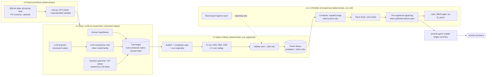

# Keep LLMs Upstream, Let Gates Decide

*Not financial advice. This report is an educational review of research papers and open-source code for a personal research prototype. It recommends no trade, product or broker. Items marked **[UNVERIFIED]** could not be confirmed against a primary source in this research round. All arXiv figures were read through a fetch-and-summarise tool, so check them against the PDFs before quoting them publicly.*

The 2024–2026 papers in your notes are real, and most of their headline mechanisms are described correctly. But the notes have one outright error and several credibility problems, and together they change what you should build. **Alpha-R1 has no S&P 500 experiment at all.** It was tested on CSI 300 and CSI 1000 for just six months (January–June 2025). The Sharpe of 1.62 belongs to CSI 300, where annualised return was 27.59%, not to the S&P 500 at 47.87% ([arXiv HTML v1](https://arxiv.org/html/2512.23515v1)). QuantaAlpha's CSI 300 numbers check out. So do AlphaAgent (KDD 2025), RiskMiner, CogAlpha (under a different title) and AlphaCrafter, but AlphaCrafter is an unreviewed preprint submitted to AAAI 2027. The IEEE BigData multi-agent paper could not be read at all. Across the whole set, the most credible evidence is not the return tables. It is the ablations and the benchmark critiques. AlphaAgent's originality and complexity regularisers nearly **double the hit ratio (0.29 vs 0.16)** ([arXiv](https://arxiv.org/html/2502.16789)). AlphaForgeBench shows LLMs that write code are reproducible, while LLMs that emit trades disagree with themselves on **54–96% of steps** ([arXiv](https://arxiv.org/html/2602.18481)). The Alpha Illusion paper shows that published agent Sharpe ratios shrink or turn negative once costs and post-cutoff tests are applied ([arXiv](https://arxiv.org/html/2605.16895)). Your prototype already embodies the right philosophy: it rejected all 252 first-run candidates at the Deflated Sharpe gate, and its pre-registered choice lost 15% a year in the holdout. So the priority is not a smarter miner. It is to harden the gates, make the ledger capture LLM provenance, and start a notarised forward test, because the holdout is spent. Keep LLMs as proposers and critics, keep every decision in deterministic code, and do not build the regime-screener or trader layers of your five-layer design as LLM components.

## Three corrections and five caveats in the claims check

The verification found six of seven named papers and confirmed their core methods. Most errors in the notes are errors of emphasis (what a paper proves), not of existence. The Alpha-R1 figures are the exception: the notes have the wrong market and the wrong numbers.

| Claim as it appears in your notes | Verified finding | Verdict |
|---|---|---|
| Alpha-R1: S&P 500 47.87% return, Sharpe 1.62; CSI 300 40.57%, Sharpe 2.23 | No S&P 500 test in v1 (the only version found). CSI 300: 12.99% cumulative, **27.59% annualised, Sharpe 1.62**, MDD 6.76%. CSI 1000 (out-of-domain): 42.49% cumulative, 78.18% annualised, Sharpe 4.03. Test window **2025-01-01 to 2025-06-30 only**, average of 5 runs, 10 bp each side. An 8B Qwen3 model trained with GRPO over Alpha101 (82 computable factors) ([arXiv HTML v1](https://arxiv.org/html/2512.23515v1); [abs](https://arxiv.org/abs/2512.23515)) | **Wrong** (market and numbers) |
| QuantaAlpha beats prior LLM miners on CSI 300 | IC 0.0472, ARR 4.68%, MDD 11.80% with GPT-5.2. Beats RD-Agent (IC 0.0286) and AlphaAgent (IC 0.0347). The **TRA deep-learning baseline has higher ARR (6.81%) and lower MDD (8.51%)** ([arXiv](https://arxiv.org/html/2602.07085)) | Accurate, but "SOTA" holds only for IC |
| AlphaAgent: KDD 2025, regularised LLM mining | Confirmed at KDD '25 ([ACM DL](https://dl.acm.org/doi/10.1145/3711896.3736838)). CSI 500 IC 0.0212, IR 1.488. S&P 500 IC only 0.0056 ([arXiv](https://arxiv.org/html/2502.16789)). Paper-era code is on the `legacy-main` branch; `main` was replaced in July 2026 by a different project ([GitHub](https://github.com/RndmVariableQ/AlphaAgent)) | Accurate; repo pointer out of date |
| RiskMiner: risk-seeking MCTS beats AlphaGen | CSI 300 IC 0.0645 ± 0.0069 vs AlphaGen 0.0604 ± 0.0109 (10 repeats), a gap inside one standard deviation ([arXiv](https://arxiv.org/html/2402.07080)). Venue: ICAIF'24 ([ACM DL](https://dl.acm.org/doi/10.1145/3677052.3698613)). No official code; only a third-party MIT repo of unverified fidelity ([GitHub](https://github.com/carlosrod723/RiskMiner-Alpha-Discovery-MCTS)) | Accurate; the gain is small |
| AlphaCrafter: full-stack miner → screener → trader | Exists; v2 retitled 28 Jul 2026. **"Submitted to AAAI 2027"**, so not peer-reviewed. Headline numbers, backbones and cost settings were not extracted ([abs](https://arxiv.org/abs/2605.05580); [v2 HTML](https://arxiv.org/html/2605.05580v2)) | Exists; treat as preprint |
| IEEE BigData 2025 multi-agent formulaic alpha framework | Only the IEEE Xplore listing was reachable (doc 11400963). Authors, method and results are unknown ([IEEE Xplore](https://ieeexplore.ieee.org/document/11400963/)) | **[UNVERIFIED]** |
| "CogAlpha" | Real title: "Cognitive Alpha Mining via LLM-Driven Code-Based Evolution" (arXiv:2511.18850). 21 agents, gpt-oss-120b, 5 datasets in 3 markets. CSI 300 IC 0.0591 vs Alpha158 0.0358. **Code "will be available"; none found** ([arXiv](https://arxiv.org/html/2511.18850)) | Accurate; not reproducible yet |
| AlphaForgeBench shows LLMs should write strategy code | Confirmed (KDD '26). Temperature moves Sharpe by <0.008. Run-to-run variance is 10× smaller than between-query variance. Absolute Sharpes are only 0.34–0.63 on 7 single assets ([arXiv](https://arxiv.org/html/2602.18481)) | Accurate |
| LiveTradeBench gives live, leak-free evidence | 21 LLMs over **50 trading days** (Aug–Oct 2025). Best stock Sharpe 2.64, Polymarket from −57.6% to +20.5%. No repeated runs ([arXiv](https://arxiv.org/html/2511.03628)) | Leak-free, but statistically underpowered |
| The Alpha Illusion: agent alpha isn't deployment evidence | Confirmed. TradingAgents' Sharpe falls from **0.43 gross to 0.22 net**. **35 of 40** system × friction cells are unmodelled. Proposes protocols P1–P6 and claim tiers ([arXiv](https://arxiv.org/html/2605.16895)) | Accurate; the most useful paper in the set |

Two cross-cutting caveats belong next to every row. First, **almost every test window overlaps the LLM's pretraining data**: GPT-3.5 over 2021–24 for AlphaAgent, GPT-5.2 over 2022–25 for QuantaAlpha, gpt-oss over 2021–24 for CogAlpha ([arXiv](https://arxiv.org/html/2502.16789); [arXiv](https://arxiv.org/html/2602.07085); [arXiv](https://arxiv.org/html/2511.18850)). None of these papers discusses cutoff leakage in the text we retrieved. The exact cutoff dates are background knowledge **[UNVERIFIED]**. Second, the research found **no independent replication** of any of the mining papers. The only cross-checks are QuantaAlpha re-running AlphaAgent and RD-Agent as baselines, and there AlphaAgent's ARR fell to 1.11% ([arXiv](https://arxiv.org/html/2602.07085)).

## What each paper really contributes, ranked by evidence

Read the papers as mechanism catalogues, not proof of profit. The absolute performance they report is modest where the protocol is long and careful, and spectacular only where it is short. QuantaAlpha's four-year CSI 300 ARR of 4.68% is roughly the size of a good single factor. Alpha-R1's 78% annualised on CSI 1000 comes from a six-month window that sits inside or near its backbone's training period. By my recollection, Qwen3 was released around April 2025, which would put that test window before its release **[UNVERIFIED]**. The pattern matches the replication literature. Published predictors earn **26% less out of sample and 58% less after publication** ([McLean & Pontiff](https://papers.ssrn.com/sol3/papers.cfm?abstract_id=2156623)), and new factors need **t > 3.0** to clear multiple-testing hurdles ([Harvey, Liu & Zhu](https://ideas.repec.org/p/nbr/nberwo/20592.html)). Your own run fits the same picture. The 20 strongest discovery candidates dropped from a mean IC of 0.031 to 0.011 in 2021–24, a decay of about 65%, which is worse than McLean-Pontiff's post-publication haircut.

| Paper | Transferable contribution | Evidence quality | Credibility | Take for your lab |
|---|---|---|---|---|
| **AlphaAgent** (KDD'25) | Regulariser = AST originality vs a factor zoo (largest isomorphic common subtree) + complexity (node count, free parameters, feature count) + LLM-judged hypothesis↔description↔expression consistency ([arXiv](https://arxiv.org/html/2502.16789)). Code default rejects zoo overlap >8 nodes ([factor_regulator.py](https://github.com/RndmVariableQ/AlphaAgent/blob/legacy-main/alphaagent/scenarios/qlib/regulator/factor_regulator.py)) | 4-year test, stated costs, 20 trials × 5 rounds, clean ablation | **Medium–high** for the mechanism; returns weak in the US | Yes: originality, complexity, consistency filter |
| **QuantaAlpha** (preprint, v3) | Trajectory-level evolution: find the one bad step, rewrite it, freeze the prefix, regenerate the rest. Crossover of good segments. Two-stage dedup (AST, then output correlation keeping the higher RankIC) ([arXiv](https://arxiv.org/html/2602.07085)) | 4-year test, 5 LLMs, cross-seed appendix | **Medium**; beaten by TRA on returns | Dedup now; trajectory mutation later as a prompt pattern |
| **RiskMiner** (ICAIF'24) | MCTS over RPN tokens; reward IC − 0.1·mean mutual IC; quantile ("risk-seeking") policy gradient with α≈0.8–0.85; pool K=100, evict smallest weight ([arXiv](https://arxiv.org/html/2402.07080)) | 2-year test, no costs stated, 10 repeats | **Medium**; small gain | Borrow the reward shape; skip the learned policy |
| **AlphaGen / AlphaForge** | Linear alpha pool with least-squares weights and eviction ([linear_alpha_pool.py](https://github.com/RL-MLDM/alphagen/blob/master/alphagen/models/linear_alpha_pool.py)); dynamic re-weighting over time ([AlphaForge](https://github.com/DulyHao/AlphaForge)) | Peer-reviewed (KDD'23, AAAI'25) | **Medium** | Reimplement ideas; **no licence, do not copy code** |
| **AlphaCrafter** (preprint) | Hard library gates: IC/RankIC >0.025 and ICIR >0.25 at 5 days, turnover <0.4, coverage >0.9, 90-day re-validation. Plus an LLM regime screener and a top-K trader ([v2 HTML](https://arxiv.org/html/2605.05580v2)) | Unreviewed; numbers not extracted | **Low–medium** | Gates yes; LLM screener no |
| **CogAlpha** (preprint) | Alphas as vectorised Python functions; quality pipeline including numerical-stability and temporal-leakage tests; percentile fitness across 5 metrics ([arXiv](https://arxiv.org/html/2511.18850)) | 4-year test, stated costs, no code | **Low–medium** | Copy the leakage/stability test idea only |
| **Alpha-R1** (preprint) | GRPO-trained 8B model does "semantic gating": each day it activates factors whose profile matches an LLM summary of news and prices ([arXiv](https://arxiv.org/html/2512.23515)) | 6-month test, direct news leakage risk, structural penalty unspecified | **Low** | Don't build |
| **AlphaForgeBench** (KDD'26) | Code-generation paradigm is deterministic; action paradigm is not ([arXiv](https://arxiv.org/html/2602.18481)) | 903 queries, 6 models, deterministic engine | **High** for reproducibility; says little about alpha | Design principle |
| **LiveTradeBench** | Live, leak-free evaluation. LMArena rank does not predict trading (Spearman 0.054 on stocks) ([arXiv](https://arxiv.org/html/2511.03628)) | 50 days, no repeats | **Medium** as warning, **low** as ranking | Reason to paper-trade longer |
| **The Alpha Illusion** | P1–P6 protocols, claim tiers, 6-stage modular pipeline with LLMs upstream only ([arXiv](https://arxiv.org/html/2605.16895)) | Reproduction on 5 tickers for 1 year, plus a friction census | **High** as a framework | Validity card backbone |
| **Surveys** | Only 2 of 19 primary studies report time-consistent splits, 1 models costs, **none reaches reproducibility tier R3** ([arXiv 2605.19337](https://arxiv.org/abs/2605.19337)). Five biases "can reverse the sign of reported returns" ([arXiv 2603.27539](https://arxiv.org/abs/2603.27539)). Protocol checklist ([New Quant](https://arxiv.org/html/2510.05533v1)) | Audits | **High** for the base rate | Reporting standard |

A sympathetic reading deserves a hearing. The formula-generating papers carry much less leakage risk than end-to-end LLM traders. The LLM only proposes an expression, and deterministic code computes IC on held-out data, so memorisation can only work indirectly through which formulas get proposed. That is exactly why your prototype's design is sound. But indirect leakage is not zero. An LLM trained on text from 2021–2025 "knows" that low-volatility and MAX-type effects were strong in recent Chinese markets, and your own Stage 1 found those very factors flipped sign after 2020. If the proposer suggests them, your 2021–24 validation cannot tell insight from recall. LLMs recall pre-cutoff economic values, and neither date instructions nor masking stops them ([Lopez-Lira et al.](https://arxiv.org/abs/2504.14765)). For LLM-sourced factors, only data after the model's cutoff counts as clean evidence.

## Code-writing agents are reproducible; trading agents are not

The benchmark papers converge on one design rule, and it matches your README's "never agents" list. AlphaForgeBench found code outputs almost temperature-invariant, while direct-action agents at temperature 0 swung from +40% to −40% across single runs ([arXiv](https://arxiv.org/html/2602.18481)). The Alpha Illusion argues three structural points ([arXiv](https://arxiv.org/html/2605.16895)). Verbal confidence is not a calibrated probability. Narrative fluency is not numerical execution. And pretraining gives models undisclosed factor tilts. Its six-stage pipeline confines the LLM to extraction, feature construction and signal synthesis. Calibration, sizing and execution are separate modules that can override it. It also reports, citing Zhang et al. (2025), that multi-agent debate wins fewer than 20% of 36 configurations. That figure is a secondary citation that was not checked against the primary paper **[UNVERIFIED]**.

The statistical side is where your lab is already ahead of the literature. Your Stage 1 used a t ≥ 3 hurdle, Deflated Sharpe ≥ 0.95 over all trials, and PBO via CSCV. That already exceeds what 17 of the 19 audited agent studies report ([arXiv 2605.19337](https://arxiv.org/abs/2605.19337)). The weak point is the **ledger**. LLM mining makes trials almost free, so the trial count N that sets the Deflated Sharpe bar ([Bailey & López de Prado](https://www.davidhbailey.com/dhbpapers/deflated-sharpe.pdf)) grows faster than your intuition. Today `agents/llm_proposer.py` prints rejected proposals and does not log them, so those trials never enter N. Token cost is not the binding constraint either. At the Sonnet 5 list price of $2 in and $10 out per million tokens ([Anthropic](https://platform.claude.com/docs/en/about-claude/models/overview)), a 20-factor proposal costs a few cents (my estimate). The binding constraint is statistical budget. Every extra proposal raises the bar for all of them, so an LLM arm earns its place only if its pass rate *per trial* beats the random-grammar arm. AlphaAgent's 0.29 vs 0.16 hit ratio is the metric to reproduce on your own data.

A 50-day live window is no cure either. With T = 50 daily observations, the standard error of an annualised Sharpe is about 2.2, so LiveTradeBench's range of 0.6–2.6 is indistinguishable from noise. That is the research team's calculation from the paper's setup ([arXiv](https://arxiv.org/html/2511.03628)). Your forward test therefore has to run for many months before it separates skill from luck. That is one more reason to start the clock now.

## The validity card your pipeline should auto-generate

Every factor, model or strategy that leaves Stage 1 should carry a machine-generated card. The card assigns the highest **Alpha Illusion claim tier** whose checks all pass. Report wording is then restricted to that tier: "improves information extraction" (T1 research aid), "produces a positive-return trajectory in this window" (T2 historical backtest), "retains net return under structural tests" (T3 deployable alpha). T4 autonomous trading requires P1–P6 ([arXiv](https://arxiv.org/html/2605.16895)), and your lab should never claim it, because by design no LLM trades. Alpha Illusion's P-protocols do not cover the statistical block (D). Making it mandatory from T2 upward is my mapping, based on the multiple-testing literature. Thresholds such as DSR > 0.95 and t > 3 are lab policy, not mandates from the papers.

| # | Check (auto-computed) | Protocol | Needed from | Status in `alpha_lab` today |
|---|---|---|---|---|
| A1 | Model provenance: model ID, knowledge cutoff, prompt hash, run ID, seed, cost | P1 | T1 | **Missing**: trial log has `source` but no model or prompt fields |
| A2 | Share of evaluation days after model cutoff; metrics split pre/post cutoff; ≥1 fully post-cutoff window for LLM-sourced factors ([Lopez-Lira](https://arxiv.org/abs/2504.14765)) | P1 | T2 | **Missing**: 2021–26 all likely pre-cutoff for current models **[UNVERIFIED cutoff]** |
| A3 | Point-in-time assertion: every input `available_ts < decision_ts`; embargo ≥ label horizon ([New Quant](https://arxiv.org/html/2510.05533v1)) | P1 | T2 | **Partial**: auditor blocks negative `Ref`; purge 10 days in Stage 2 |
| A4 | Lookahead-propensity probe for any text/news feature ([Gao, Jiang & Yan](https://arxiv.org/abs/2512.23847)) | P1/P3 | T2 (text only) | N/A until text features exist |
| B1 | Dynamic universe: point-in-time constituents, delistings, liquidity and borrow rules | P2 | T2 | **Have** for CSI 300; **not** for a Yahoo US/UK port |
| B2 | Breadth: asset and year counts; flag <10 assets as anecdotal | P2 | T2 | Have (300 names, 15 years) |
| C1 | Gross-to-net waterfall: commission, spread/slippage, stamp duty, impact, **token cost**, delay | P5 | T3 | **Partial**: costs and 2× stress present; no token-cost or impact line |
| C2 | Turnover, break-even cost in bp, capacity estimate | P5 | T3 | **Partial**: turnover reported; break-even missing |
| C3 | Net-of-cost baselines: index, equal-weight, momentum, Alpha158+LightGBM; factor-regression alpha t | P5 | T2 | **Partial**: index and Alpha158 present |
| D1 | Sharpe standard error / CI and minimum track-record length | stats | T2 | **Missing** |
| D2 | Complete trial ledger including LLM rejects, N per family | stats | T2 | **Partial**: LLM rejects not logged |
| D3 | Deflated Sharpe > 0.95 given N ([Bailey & López de Prado](https://www.davidhbailey.com/dhbpapers/deflated-sharpe.pdf)) | stats | T2 | **Have** |
| D4 | PBO via CSCV (S=16) and IS→OOS degradation slope ([Bailey et al.](https://www.davidhbailey.com/dhbpapers/backtest-prob.pdf)) | stats | T2 | **Have** (PBO); slope missing |
| D5 | t > 3 or Benjamini-Yekutieli FDR across the batch; Hansen SPA when picking a winner ([Hansen](https://doi.org/10.1198/073500105000000063)) | stats | T2 | **Have** t ≥ 3; FDR/SPA missing |
| D6 | Novelty: AST overlap vs zoo, max correlation vs Alpha158/Alpha101 and, for US, the 319 Open Source Asset Pricing signals ([Chen-Zimmermann](https://ideas.repec.org/a/now/jnlcfr/104.00000112.html)) | stats | T2 | **Partial**: corr < 0.7 vs accepted set only |
| D7 | Decay haircut: expected live premium = backtest × (0.42–0.74) ([McLean-Pontiff](https://papers.ssrn.com/sol3/papers.cfm?abstract_id=2156623)) | stats | T3 | **Missing** (your observed decay was about 65%) |
| E1 | Run-to-run variance across seeds or models for LLM proposals ([AlphaForgeBench](https://arxiv.org/html/2602.18481)) | P3 | T2 | **Missing** |
| E2 | Source ablation: pass rate per trial for LLM vs random vs human; net delta of each agent | P6 | T2 | **Missing** (no LLM candidates in run 1) |
| E3 | Calibration (ECE) for any confidence used in sizing | P4 | T3 | N/A by design: LLM confidence never sizes |
| E4 | Regime, sub-period and sector breakdown | P2/P5 | T3 | **Partial**: regime flips noted by hand |
| E5 | Holdout integrity flag: how many times the holdout was viewed, and under which choices | stats | T2 | **Have** in honesty log; make it machine-readable |
| E6 | Forward pre-registration: hashed signal file published before the open, days elapsed | P1 | T3 | **Missing**, and now the only clean test |
| E7 | Reproducibility tier R0–R3: frozen code SHA, data hash, prompts, model snapshot ([arXiv 2605.19337](https://arxiv.org/abs/2605.19337)) | P6 | T2 | **Partial** |
| E8 | Claim-tier label and allowed wording, auto-downgraded on any failure | all | always | **Missing** |

Under this card, the prototype's best result today, variant C, reaches at most **T1 with a T2 caveat**. Its holdout number (+3.7% excess, IR 0.26) is descriptive only, because the honesty log records that holdout results were seen under both selection choices. Nothing in the lab qualifies for T3. That is the correct and honest state, not a failure.

A card can be one JSON record per candidate, written next to `trial_log.csv`:

```json
{"id":"llm_0042","source":"llm","model":"claude-sonnet-5","prompt_sha":"…","parent":null,
 "ast_nodes":14,"free_params":2,"zoo_overlap_nodes":5,"max_corr_alpha158":0.41,
 "ic_t":3.4,"dsr":0.91,"n_trials_at_eval":612,"pbo":0.08,"postcutoff_days":0,
 "net_ir_2x_cost":0.12,"breakeven_bp":18,"tier":"T1","allowed_claim":"research aid only",
 "fails":["dsr<0.95","no post-cutoff window"]}
```

## Revised architecture: researchers upstream, deterministic gates downstream

Your five-layer design becomes three zones. Layers 0–2 (data, miner, validation and library) are the lab's core, and LLMs work only inside the miner as proposers and critics. Layer 3, the regime screener, becomes a deterministic *reporting* module rather than an LLM that picks factors each day. Layer 4, strategy and trader, stays the existing deterministic top-30 weekly book. Layer 5, execution and monitoring, starts as a notarised forward-signal log. "Harness-wrapped agents" means one thin client that logs, caches and schema-validates every call. It is not an agent framework.



| Component (your layer) | Decision | Reason: evidence, cost, licence |
|---|---|---|
| AST parser + whitelist replacing regex auditor (L0/L2) | **Build now** | Qlib's `parse_field` rewrites strings with regex and then calls `eval()` ([qlib source](https://github.com/microsoft/qlib/blob/main/qlib/utils/__init__.py)). A regex whitelist does not block attribute access such as `$close.__class__`, so LLM output must be parsed with `ast` and walked against allowed nodes before it reaches Qlib. The AST is also the basis for complexity and originality checks |
| Complexity caps + zoo originality (L2) | **Build now** | Best-evidenced mechanism (AlphaAgent ablation). Pure AST counts, so no cost. Port ideas from `factor_ast.py` on `legacy-main` (MIT, keep the Microsoft notice) ([GitHub](https://github.com/RndmVariableQ/AlphaAgent/tree/legacy-main)) |
| Ledger v2 + validity card + claim tier (L2) | **Build now** | DSR, PBO and FDR are only valid if N is complete ([DSR](https://www.davidhbailey.com/dhbpapers/deflated-sharpe.pdf)) |
| LLM harness: structured output, JSONL log, disk cache (L1) | **Build now** | Temperature may be rejected on Claude 5-era models **[UNVERIFIED]** ([issue](https://github.com/verdikta/verdikta-arbiter/issues/51)), so reproducibility must come from logging and caching. Use `client.messages.parse` with a Pydantic schema ([docs](https://platform.claude.com/docs/en/build-with-claude/structured-outputs)) |
| Notarised forward-signal log (L5) | **Build now** | Holdout is spent. This is also the only post-cutoff test for LLM-sourced factors |
| LLM hypothesis-consistency critic (L1) | **Build now**, as a reject/repair filter | Cheap. LLM-judge scores are noisy, so use them as pass/fail, not as fitness ([AlphaAgent](https://arxiv.org/html/2502.16789)) |
| Two-stage dedup, AST then output correlation (L2) | **Build now** | Your corr < 0.7 check already covers stage 2; QuantaAlpha adds the AST stage and keeps the higher RankIC of a correlated pair ([arXiv](https://arxiv.org/html/2602.07085)) |
| GP refiner seeded by LLM expressions (L1) | **Build later** | Own mutation and crossover on your AST. DEAP is **LGPL-3.0**: fine as an unmodified dependency, but modified files stay LGPL. gplearn is BSD-3 but lacks panel operators ([PyPI deap](https://pypi.org/project/deap/); [gplearn](https://pypi.org/project/gplearn/)) |
| Library manager: AlphaCrafter gates + probation (L2) | **Build later** (needs a library first) | Library is empty after run 1. Gates from [AlphaCrafter v2](https://arxiv.org/html/2605.05580v2); re-validation adds tests to the ledger |
| Linear/ridge pool combiner with eviction (L3) | **Build later** | AlphaGen pool is proven but **unlicensed**: reimplement, don't copy ([alphagen](https://github.com/RL-MLDM/alphagen)) |
| QuantaAlpha trajectory mutation (L1) | **Build later**, as a prompt pattern | Real mechanism, but its advantage is IC only; QuantaAlpha code licence unverified |
| Rule-based regime report (L3) | **Build later**, reporting only | Your own regime flips justify measuring regimes. hmmlearn is in limited-maintenance and its state labels are unstable ([hmmlearn](https://github.com/hmmlearn/hmmlearn)) |
| IBKR paper mirror (L5) | **Build later** | ib_async 2.1.0, BSD. Needs a funded IBKR account; paper fills are simulated ([ib_async](https://github.com/ib-api-reloaded/ib_async); [IBKR](https://www.interactivebrokers.com/docs/tws-api/doc/notes-limitations/limitations/paper-trading)) |
| RD-Agent(Q) as external baseline | **Build later**, optional | MIT and active, but Linux- and Docker-only ([RD-Agent](https://github.com/microsoft/RD-Agent)) |
| MCTS with RiskMiner reward (L1) | **Don't build yet** | Gain over AlphaGen is within one SD; no official code |
| GRPO semantic gating (Alpha-R1) | **Don't build** | GPU fine-tuning of an 8B model plus a news pipeline; six-month evidence; direct leakage |
| LLM regime screener picking factors daily (AlphaCrafter L3) | **Don't build** | Unreviewed; recurring token cost; semantic regime labels are exposed to leakage and add trials no one counts |
| LLM trader, sizing or execution (your L4/L5 as agents) | **Don't build** | Action instability ([AlphaForgeBench](https://arxiv.org/html/2602.18481)); net Sharpe collapse ([Alpha Illusion](https://arxiv.org/html/2605.16895)) |
| 21-agent CogAlpha zoo, multi-agent debate | **Don't build** | No code; coordination has to beat its own cost ([arXiv 2603.27539](https://arxiv.org/abs/2603.27539)) |
| Vendored AlphaGen/AlphaForge code | **Don't build** | No licence file means all rights reserved ([AlphaForge](https://github.com/DulyHao/AlphaForge)) |

**Qlib status matters for the pin in your `requirements.txt`.** Qlib's `main` branch is active, with CI commits on 2026-09-16 and a **RestrictedUnpickler security fix on 2026-03-10**. But the latest PyPI release is still **0.9.7 from 2025-08-15**, so `pyqlib==0.9.7` misses the 2026 fixes ([qlib commits](https://github.com/microsoft/qlib/commits/main); [PyPI](https://pypi.org/project/pyqlib/)). Install from a pinned git SHA and stay on Python 3.11 or 3.12, which CI tests on Windows, Linux and macOS ([workflows](https://github.com/microsoft/qlib/tree/main/.github/workflows)). The official pre-built dataset is "temporarily unavailable" ([README](https://github.com/microsoft/qlib)). The Yahoo collector covers CN, US, IN and BR but not the UK ([yahoo collector](https://github.com/microsoft/qlib/tree/main/scripts/data_collector/yahoo)). A UK port therefore needs custom CSVs through `dump_bin.py`, and free sources cannot supply point-in-time FTSE membership. Keep the repo MIT to match Qlib and RD-Agent. `anthropic>=0.40` should become `>=1.7`, the current release ([PyPI](https://pypi.org/project/anthropic/)).

## A prioritised build list mapped to your files

The order follows one logic: fix what could make results invalid or unsafe, then measure whether the LLM arm adds anything, and only then make the miner smarter.

| Priority | Change | Where | Source mechanism | Done when |
|---|---|---|---|---|
| **P0-1** | AST parser, whitelist of `ast` node types, canonical form (sorted commutative args, window buckets) | new `lab/expr.py`; `lab/auditor.py` calls it | Qlib `eval()` risk; AlphaAgent `factor_ast.py` | `tests/test_auditor.py` includes dunder and attribute-access attacks |
| **P0-2** | Ledger v2: `run_id, source_model, model_id, prompt_sha, parent_id, seed, tokens, cost_usd, n_trials_at_eval`; log **every** LLM reject | `lab/trial_log.py`, `agents/llm_proposer.py` | DSR/HLZ trial counting | Proposer writes a row for every proposal |
| **P0-3** | Harness: `LLMClient.complete(messages, schema)` with Pydantic output, JSONL call log and sqlite cache keyed by prompt hash | new `agents/harness.py` | Reproducibility without temperature | Rerunning a proposal batch costs $0 and reproduces it byte for byte |
| **P0-4** | Validity card + tier label from existing stats, plus Sharpe SE, degradation slope, break-even bp, decay haircut | new `lab/card.py`, called by both stages | Alpha Illusion tiers; McLean-Pontiff | Every candidate has a card; reports quote only `allowed_claim` |
| **P0-5** | Forward pre-registration: weekly signal parquet, manifest (git SHA, data hash, config hash), hash committed before Monday's open | new `forward/` job | Notarised OOS | 13 weekly entries before any promotion discussion |
| **P0-6** | Pin Qlib to git SHA; bump `anthropic` | `requirements.txt` | Qlib status | Sanity tests pass on the new pin |
| **P1-1** | Complexity caps (for example ≤25 nodes, ≤4 raw fields, ≤3 free constants; my suggested values) and zoo-overlap rejection vs Alpha158 + accepted factors (start at 8 nodes, the AlphaAgent default) | `lab/expr.py` | AlphaAgent regulariser | Caps set in `config.py` before the next run |
| **P1-2** | Consistency critic, preferably a different model family; pass/fail on hypothesis↔expression; one repair attempt, logged as a new trial | `agents/critic.py` | AlphaAgent C(h,d,f); QuantaAlpha verifier | Reject reasons appear in the ledger |
| **P1-3** | Source ablation run: hypotheses vs LLM vs random, with pass rate per trial at t ≥ 3 and survival into 2021–24 | `stage1_mine.py` report | Alpha Illusion P6 | A written go/no-go on keeping the LLM arm |
| **P1-4** | US port (Yahoo + `us_index` SP500 membership), with survivorship caveat printed on every card; UK stamp duty on buys | `lab/config.py`, `lab/backtest.py` | Qlib collectors | Sanity tests (oracle, random, stale) re-pass |
| **P2-1** | GP refiner of LLM seeds: fitness RankIC − λ·nodes − μ·max\|corr\| to pool | `lab/miner.py` | RiskMiner reward; AlphaGen pool | Refined children counted as trials |
| **P2-2** | Library with AlphaCrafter gates, probation and retirement; equal → IC → ridge combiner | `lab/library.py` | AlphaCrafter; AlphaGen | Weight vectors logged with timestamps |
| **P2-3** | Rule-based regime breakdown on every card (index vs 200-day MA, volatility percentile, dispersion) | `lab/card.py` | New Quant stress breakdown | Reporting only, never allocation |
| **P2-4** | Trajectory mutation prompt: the critic names the failing step, and the proposer rewrites only that step | `agents/` | QuantaAlpha | Parent-child links in the ledger |
| **P2-5** | IBKR paper mirror via ib_async; journal agent summarising the ledger each week | `forward/` | Earlier report's Phase D | Fills reconcile to signals |

## What remains unverified

Several items should be checked before you rely on them. None of them changes the architecture, but they do change what you can quote.

| Item | Status |
|---|---|
| IEEE BigData 2025 multi-agent paper | Content unreadable; authors and results unknown |
| AlphaCrafter headline numbers, LLMs, dates, costs | In §3.2 / Appendix B; not extracted |
| Code licences: QuantaAlpha, Alpha-R1, new AlphaAgent `main` | Not verified |
| Qwen3 release date and the cutoffs of GPT-3.5, GPT-5.2, gpt-oss and Claude Sonnet 5 | Background knowledge only |
| Temperature rejected on Claude 5-era models | Third-party GitHub issues only |
| Li et al. (2025) contamination drops (FinMem −71.85%, QuantAgent Sharpe −51.48%) and Zhang et al. debate figure | Seen only as citations inside the Alpha Illusion paper |
| LiveTradeBench worst stock model | Inconsistent in the fetched text |
| AlphaForge dynamic-weighting details; AlphaGen, RD-Agent(Q) and Alpha-GPT papers | Not fetched this round |
| Fidelity of the third-party RiskMiner repo | Unverified |

## Conclusion

The literature's real lesson is not that a cleverer LLM miner finds alpha. The papers that tested honestly found modest, decaying signals, and the papers with spectacular numbers tested briefly and inside their models' memory. Your prototype has already reached the same conclusion from its own data: zero of 252 candidates cleared the Deflated Sharpe gate, and a hand-picked composite reversed in the holdout. So the competitive advantage of this lab is its refusal machinery, not its generator. LLMs are worth their few cents per batch only if they raise the pass rate per trial above random search, and your ledger has to prove that rather than assume it.

The design implication is that tokens are cheap but trials are expensive. Every extra proposal, critic retry and regime-gated re-selection spends statistical budget that the Deflated Sharpe will charge back. That is why the daily LLM screener and the LLM trader should go even though they look like progress, and why the unglamorous work comes first: an AST whitelist, a complete ledger, a card that downgrades its own claims, and a hashed forward log. From September 2026 the forward log is also the only window that sits after your proposer's training cutoff. In a year, it will be the one piece of evidence in the lab that nobody, including the LLM, could have seen in advance.
