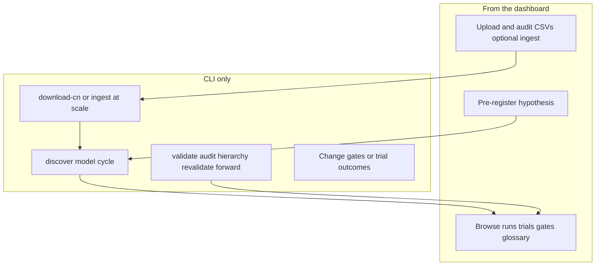

# Product fit-gap: dashboard as an end-user harvest experience

This document is separate from [fit-gap.md](fit-gap.md), which scores **packaging** (clone,
Docker, CI). Here the question is narrower:

**Can someone open the dashboard and start the alpha-harvesting process like a product?**

**Short answer: no — and that is mostly deliberate.** The dashboard is a **read-mostly research
viewer** with two **safe writes** (pre-register a hypothesis, add a data source). Every stage that
actually moves the pipeline (`discover`, `model`, `cycle`, `forward publish`, …) is a **CLI
decision**, recorded in the ledger. There is no “Start harvest” control anywhere in the UI.

This note records an **end-user walk** (empty lab, then a synthetic harvest) performed on
2026-09-22 against v0.15.0, and lists **product gaps** plus **UX options** that do not weaken
the p-hacking controls.

---

## User job

> “I cloned the repo, opened `http://127.0.0.1:8000`, and want to click through to harvesting
> alpha — or at least know exactly what to do next without reading the whole README.”

---

## Current fit (what works as designed)

| Property | Behaviour | Why it exists |
|---|---|---|
| **Research viewer** | Ten nav pages + run detail; JSON under `/api/…`; numbers match CLI/DB | [frontend.md](frontend.md): nothing recomputed in the web layer |
| **Two safe writes** | `POST /hypotheses`, `POST /data` (audit-only by default) | Pre-registration and ingestion happen *before* evidence; tests enforce a four-path allowlist |
| **Gates read-only** | `/gates` shows live thresholds; no slider, no `POST /api/gates` | Relaxing a gate after seeing rejections is the fastest path to a false discovery |
| **Empty states** | Most harvest pages say `Run: alphalab …` | Honest redirect to CLI |
| **Always-on pages** | Gates, Glossary, Hypotheses form, Data upload | Explain machinery without a prior run |
| **Disclaimer** | Footer + README + NOTICE | “Research software. It does not place orders and nothing here is financial advice.” |

Design intent is stated in `src/alphalab/web/app.py`: a UI that can re-run discovery until
something clears is a **p-hacking console**; launching runs stays CLI/cron.

---

## Walk 1 — empty lab (`configs/local_offline.yaml`, fresh DB)

**Setup:** `alphalab init --stack mock`, `make db`, `alphalab serve -c configs/local_offline.yaml`
(no market data under `data/cn_data`).

### Page-by-page (empty)

| Page | What the user sees | Suggested next step in UI |
|---|---|---|
| **Runs** (`/`) | Summary cards all **0**; empty runs table (no “Nothing to show yet” banner) | None — no pointer to `init` / data / discover |
| **Loop** | Empty macro → `alphalab discover` | Same |
| **Search** | Empty macro → `alphalab discover` | Same |
| **Library** | Empty macro → `alphalab discover` | Same |
| **Decay** | Empty macro → `alphalab revalidate` | Same |
| **Audit** | Empty macro → `alphalab audit` | Same |
| **Hierarchy** | Empty macro → `alphalab hierarchy` | Same |
| **Forward** | Empty macro → `alphalab forward publish` | Same |
| **Versions** | Empty table (no macro) | No hint that versions need runs + committed snapshots |
| **Gates** | Fully populated from live config | Useful without data |
| **Hypotheses** | Form + “Nothing pre-registered yet…” | Points at shipped `hypotheses.py`, not discover |
| **Data** | “No data yet… `download-cn` or upload CSVs” + upload form | Does not mention `ingest` CLI or `--write-config` |
| **Glossary** | Full term list | Useful without data |

**Footer (every page):** dashboard may only pre-register a hypothesis and add a data source;
thresholds and ledger are read-only.

### Writes exercised (Walk 1)

1. **Pre-register hypothesis** (`POST /api/hypotheses`): accepted; receipt SHA returned; API
   note says it is “Recorded, not accepted” and counts toward trial deflation when `discover`
   runs. **Trials and library stayed at 0** — correct.
2. **Data audit-only upload** (one symbol): “no problems found”, `ingested: false`, staged under
   `runs/uploads/…`. **Does not** appear as a tradable universe until CLI ingest or checked
   “Ingest if audit is clean”.

### Walk 1 product finding

There is **no** button or menu item for Discover, Model, Cycle, Sanity, Doctor, or Download.
The user must leave the browser and use the terminal. That matches the architecture; it does
**not** match the expectation of “I opened the app.”

---

## Walk 2 — synthetic harvest (no 570 MB CN download)

**Goal:** Populate real pages without `alphalab download-cn`.

**Steps performed:**

1. Generated **55** synthetic daily OHLCV CSVs (2012–2024).
2. `alphalab ingest --csv … --dest data/synth_ux --write-config configs/synth_ux.yaml`
   (mock LLM in generated config; mining budget trimmed for a short run).
3. `alphalab doctor`, `alphalab sanity` — passed.
4. `alphalab discover -c configs/synth_ux.yaml --no-gp` — **42 trials**, **0 library factors**
   (all rejected by gates; expected on random data).
5. `alphalab model`, `alphalab audit`, `alphalab hierarchy` on the same config.
6. `alphalab serve -c configs/synth_ux.yaml` (must match config name → `runs/synth_ux/`).

### Page-by-page (after harvest)

| Page | Populated? | Notes |
|---|---|---|
| **Runs** | Yes | 3 runs, 49 trials, 42 distinct formulas; treadmill may appear once trials exist |
| **Run detail** | Yes | Trial table (mostly rejected); validity **cards** after `model` |
| **Search** | **Partial** | Top cards (distinct trials, DSR hurdle, PBO) filled; **family table empty** with `--no-gp` / zero bandit family rows — confusing mix of “data” + “Nothing to show yet” |
| **Loop** | **Empty** | No library factors → “No factors have entered the library yet” despite 42 trials |
| **Library** | **Empty** | Same — rejects are on run detail, not library |
| **Decay** | **Empty** | `revalidate` correctly no-ops on empty library |
| **Audit** | Yes | Convention uplift table + synthetic fundamentals-timing line |
| **Hierarchy** | Yes | Family-level table (0 survivors on this run) |
| **Forward** | Empty | Not run (calendar / manifest workflow) |
| **Versions** | Partial | Groups DB runs by version/git SHA; enrichment from `results/*/summary.json` when version matches |
| **Data** | Yes | Ingested `synth_ux` path; “In use” when config matches |
| **Hypotheses** | Yes | Walk 1 pre-registration still listed |

**Health API:** `config: synth_ux`, `runs: 3`, `trials: 49`, version `0.15.0`.

### HARVESTING stages vs dashboard (after Walk 2)

| [HARVESTING.md](../HARVESTING.md) stage | Visible in UI after walk | Still CLI-only |
|---|---|---|
| Hypothesis | Form + list; shipped hypotheses in code | `propose`, `critique`, random arm |
| Screen / evaluate / gate | `/gates`; rejects on **run detail** | Launch `discover`; edit gates |
| Library / loop / decay | Empty when nothing passes gates | `revalidate`, promote/retire |
| Model / cards | Run detail cards | `alphalab model` |
| Construct | **No page** | `portfolio-trial` |
| Validate | **No page**; `validation.json` not in artefact whitelist | `alphalab validate` |
| Audit / hierarchy | `/audit`, `/hierarchy` once CLI run | Start jobs from UI |
| Forward | `/forward` empty until publish | `forward publish` / `evaluate` |
| Cycle | — | Entirely CLI |

Artefact keys served by the dashboard are fixed in `src/alphalab/web/artefacts.py` (`ARTEFACTS`).
There is no whitelist entry for `validation.json`, so even after `alphalab validate` there is
nowhere in the UI to view CPCV / overfitting-factor output unless a new page is added.

---

## Product gaps (ranked)

### P0 — expectation mismatch

1. **“Open dashboard = start harvesting”** — False. The product surface is observability + two
   pre-evidence writes, not orchestration.
2. **No onboarding path in the UI** — README/`HARVESTING.md`/`init` output carry the sequence;
   the dashboard never shows `init → data → doctor → discover → serve -c <same config>`.

### P1 — friction that looks like bugs

3. **Config / serve mismatch** — Artefacts and loop/search/library read `runs/<cfg.name>/`.
   Serving with `-c configs/local_offline.yaml` while harvesting `synth_ux` shows **empty**
   harvest pages even after a successful CLI run. Data ingest writes `configs/{name}.yaml` and
   tells the user to run `doctor -c …` but **does not** say “restart `alphalab serve` with that
   config.”
4. **Runs home with zero runs** — No empty-state macro; cards show 0 with no “start here” copy
   (unlike Loop/Library).
5. **Search partial empty state** — Summary metrics without family table reads as broken when
   bandit families are empty (e.g. `--no-gp` or failed family allocation).
6. **Loop/Library empty despite many trials** — Correct scientifically (nothing passed gates) but
   hides the main artifact of discover (reject reasons live on run detail only).

### P2 — coverage holes (documented, not bugs)

7. **Construct and validate** — No dashboard pages; validate output not whitelisted for API.
8. **Committed `results/`** — Markdown/JSON snapshots for humans/git; **Versions** joins them to
   DB runs by version string — they do not backfill Runs/Loop on an empty database.
9. **Mock/offline does not remove data** — `local_offline.yaml` still expects `data/cn_data`; mock
   only removes LLM/network. Minimum harvest without 570 MB download requires **ingest** (Walk 2).

### P3 — intentional controls (not gaps to “fix” blindly)

10. **No run launcher in UI** — Prevents sorting by DSR and re-running until something clears.
11. **Gates not editable** — Config file + hash trail; exceptions via `alphalab exception`.

---

## Evidence: what an end user can vs cannot do

| Action | Dashboard | CLI |
|---|---|---|
| See gate rules and live values | Yes (`/gates`) | Config YAML |
| Pre-register idea | Yes | — |
| Upload CSVs | Yes (audit; ingest optional) | `alphalab ingest` |
| Download CN dataset | No | `alphalab download-cn` |
| Run discovery / model / cycle | **No** | Yes |
| Protocol audit, hierarchy, forward | View after run | Must run first |
| Portfolio trial, validate | **No UI** | Yes |

---

## Recommendations (options only — not implemented here)

These preserve the research invariant: **no write may change a rule or a result.**

### Option A — Onboarding page (recommended first)

Add a read-only **`/start`** (or expand **Data** / home) with a checklist:

1. `alphalab init --stack mock`
2. `make db`
3. Data: `download-cn` **or** ingest / dashboard upload with ingest checked
4. `alphalab doctor -c <config>`
5. `alphalab discover -c <config>` (and optional next commands)
6. `alphalab serve -c <same-config>` — **emphasise config name = run directory**

No new POST routes; no run buttons.

### Option B — Config-aware “next command” strip

On empty states, show copy-paste commands including **current** `cfg.name` from the running
server, e.g. `alphalab discover -c configs/synth_ux.yaml`. Optionally detect “runs exist for
other configs” and warn when `runs/synth_ux` has data but the server uses `local_offline`.

### Option C — Richer empty states on Runs and Search

- **Runs:** when `runs==0`, use the same `empty()` macro as Loop with the first three commands.
- **Search:** when summary exists but `families` is empty, replace the generic empty macro with
  “No family allocation recorded (GP/bandit may be off or no trials passed screen). See run
  detail for rejects.”

### Option D — One-shot job runner (defer; high risk)

A button that shells out to `discover` would require a **job queue**, log streaming, and the
same gate immutability guarantees. Still **no** gate sliders. Treat as a separate product decision;
see [frontend.md](frontend.md) “What this plan deliberately does not do.”

### Option E — Read-only validate / construct pages (later)

Whitelist `validation.json` and add `/validate` and `/portfolio` pages that only **display**
CLI output — still no re-run from UI.

---

## Minimum paths for a demonstrable harvest

**A. Documented default (570 MB):**  
`init` → `make db` → `download-cn` → `make offline` (or discover/model) →  
`alphalab serve -c configs/local_offline.yaml`

**B. No large download (Walk 2):**  
ingest ≥ ~50 symbols → `discover` → `model` → `serve -c configs/<ingest-name>.yaml`

Expect **empty library** on random/synthetic data; the dashboard still demonstrates Runs, Audit,
Hierarchy, and run-level rejects — not a winning factor.

---

## Relation to other docs

| Doc | Scope |
|---|---|
| [fit-gap.md](fit-gap.md) | Packaging, Docker, CI, lockfile |
| [frontend.md](frontend.md) | Dashboard design; read-only invariant; two permitted writes |
| [HARVESTING.md](../HARVESTING.md) | Scientific pipeline stages |
| [feedback-loop.md](feedback-loop.md) | Which loop pages close which audit findings |

---

## Walk log (reproducibility)

- **Repo path:** `/home/kevin_admin/projects/rabbitfish_alpha`
- **Walk 1 config:** `local_offline`, empty DB, no `data/cn_data`
- **Walk 2 config:** `synth_ux`, 55-symbol ingest, discover with `--no-gp`, then model/audit/hierarchy
- **Dashboard:** `alphalab serve -c configs/synth_ux.yaml` on port 8000
- **No code or research logic changed** for this document; local `configs/synth_ux.yaml`,
  `data/synth_ux/`, and `runs/synth_ux/` were created only to exercise the UI (gitignored data/runs).
